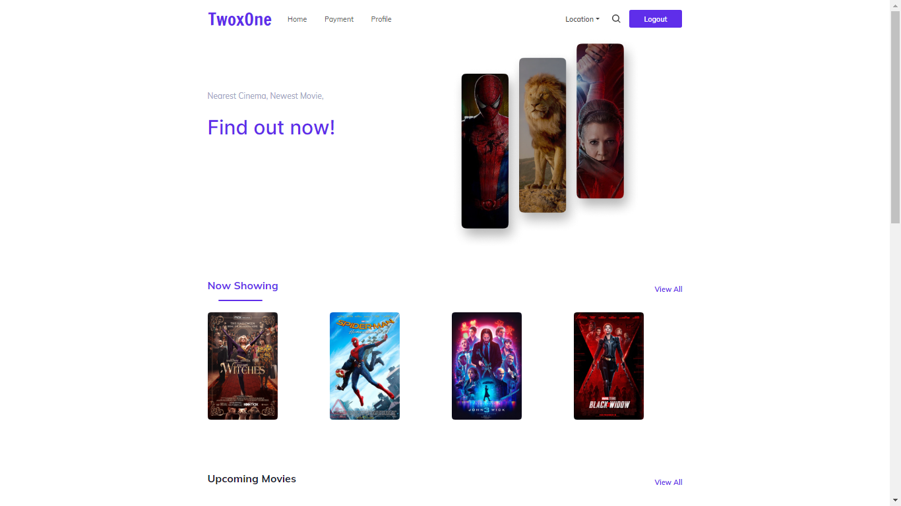

<h1 align='center'>React JS -TwoxOne</h1>
  <p align="center">
    <a href="https://twoxone.netlify.app/">View Demo</a>
    ·
    <a href="https://github.com/doyzfin/TwoxOne-FrontEnd/issues">Report Bug</a>
    ·
    <a href="https://github.com/doyzfin/TwoxOne-FrontEnd/pulls">Request Feature</a>
  </p>



## About The Project

Frendly Interface for All user, and no need to queue when buying tickets. Enjoy watching

## Built With

[](https://github.com/facebook/react)
[](https://github.com/react-bootstrap/react-bootstrap)

## Requirements

1. <a href="https://nodejs.org/en/download/">Node Js</a>
2. Node_modules `npm install` or `yarn install`
3. Backend API TwoxOne-BackEnd [`here`](https://github.com/doyzfin/TwoxOne-BackEnd)

## Getting Started

1. Download this Project or you can type `git clone https://github.com/doyzfin/TwoxOne-FrontEnd.git`
2. Open app's directory in CMD or Terminal
3. Type `npm install` or `yarn install`
4. Add .env file at root folder project

```sh
REACT_APP_BACKEND_URL = http://localhost:3001/api/v1
```

5. Type `npm start`

## Acknowledgements

- [Axios](https://www.npmjs.com/package/axios)
- [React](https://reactjs.org/)
- [React Bootstrap](https://react-bootstrap.github.io/)

## License

© [Muhammad Alfin Ramadhan](https://github.com/doyzfin/)
